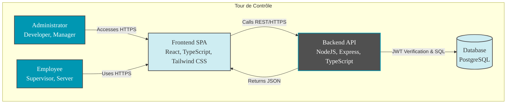
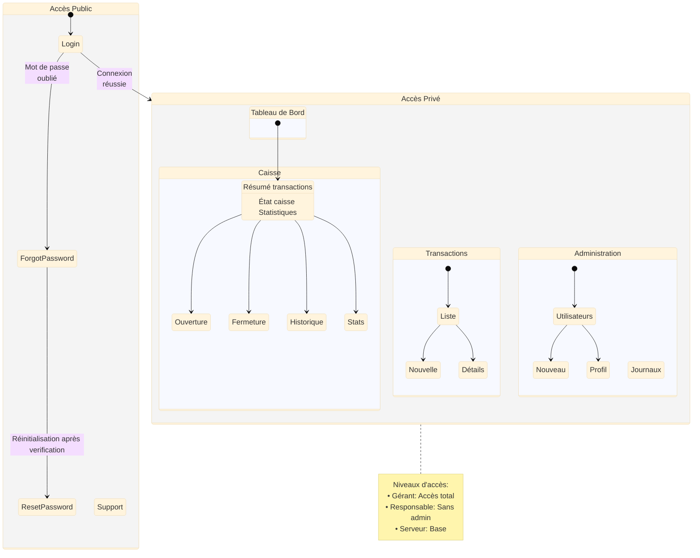
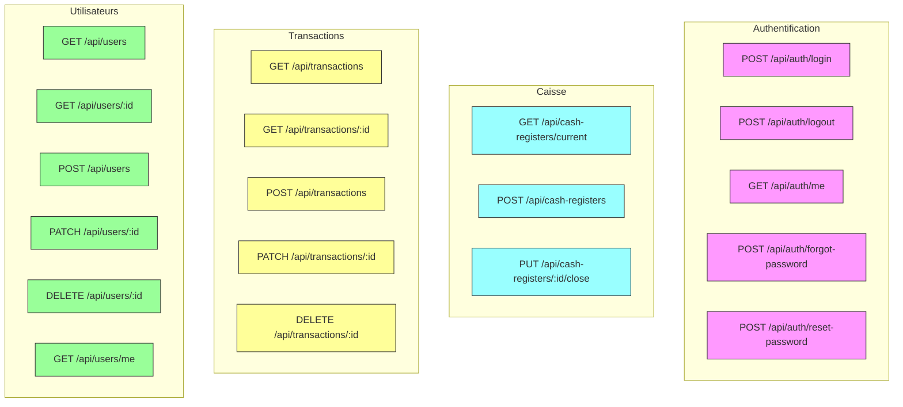

# Cahier des Charges - Application Web "Tour de Contrôle"

*Date : Novembre 2024*

## Présentation de l'entreprise

DAP-Services est une entreprise de services numériques spécialisée dans les solutions de gestion pour la restauration. Fondée en juin 2022 par Daniel Amaral Pereira, l'entreprise accompagne les restaurateurs dans la digitalisation de leurs opérations.

**Nom de l'application**: "Tour de Contrôle"

## **Définition des besoins et objectifs**

### **Contexte et problématiques**

Les restaurateurs font face à de nombreux défis dans la gestion quotidienne de leurs établissements :
- Complexité du suivi des transactions et des modes de paiement
- Risques d'erreurs dans la gestion manuelle des caisses
- Temps considérable consacré aux tâches administratives
- Difficulté à obtenir une vue d'ensemble des performances

### **Solution proposée**

L'application web propose une solution intégrée pour :
- **Optimisation opérationnelle**
  - Gestion numérisée des transactions
  - Suivi en temps réel des paiements
  - Automatisation des clôtures de caisse
- **Sécurité et fiabilité**
  - Stockage sécurisé des données
  - Traçabilité des opérations
  - Rapports automatisés
- **Performance et efficacité**
  - Interface intuitive
  - Processus optimisés
  - Tableaux de bord personnalisables
  - Analyses détaillées des performances

L'application s'adapte à tous types d'établissements et permet aux restaurateurs de se recentrer sur leur cœur de métier : l'expérience client et le développement commercial.

## **Fonctionnalités du projet**

### **MVP (Minimum Viable Product)**

- **Gestion des caisses**:
  - Enregistrement des transactions (montant, type de paiement, pourboire).
  - Gestion des modes de paiement (espèces, chèques, cartes, tickets restaurant).
  - Clôture de caisse (saisie des fonds physiques).
  - Calcul automatique des écarts entre les fonds physiques et les transactions enregistrées.
  - Historique des transactions avec filtres (date, type de paiement, montant).
- **Gestion des utilisateurs et des permissions**:
  - Création et gestion des comptes utilisateurs (gérant, responsable, serveur).
  - Attribution de rôles et de permissions.
  - Journalisation des actions des utilisateurs (connexion, déconnexion, enregistrement de transaction, clôture de caisse).
- **Sécurité et conformité**:
  - Chiffrement des mots de passe.
  - Stockage sécurisé des données sensibles.
- **Fiabilité et disponibilité**:
  - Sauvegarde automatique des données.

### **Évolutions potentielles (post-MVP)**

- **Priorité élevée**:
  - Gestion des caisses de plusieurs restaurants.
  - Gestion du personnel (ajout, modification, suppression, planning).
  - Planification des horaires et suivi des heures travaillées.
  - Gestion des informations personnelles.
- **Priorité moyenne**:
  - Gestion des stocks (suivi, alertes, commandes fournisseurs).
  - Analyse avancée des données (rapports détaillés, tableaux de bord).
- **Priorité basse**:
  - Intégration avec les systèmes de comptabilité.
  - Récupération automatique des données des TPE (via API ou import de fichiers).

## **Technologies utilisées**

- **Frontend**:
  - **React avec TypeScript**: Choisi pour sa robustesse et sa large adoption dans l'industrie. Le typage strict de TypeScript nous aide à prévenir les erreurs avant même que l'application ne démarre.
  - **Tailwind CSS**: FAdopté pour sa flexibilité et son approche utilitaire qui accélère le développement. Parfait pour créer rapidement des interfaces responsives sans écrire de CSS personnalisé.
  - **Axios**: Retenu pour sa simplicité d'utilisation et sa gestion élégante des requêtes API. Il gère automatiquement les transformations JSON et les headers HTTP.
  - **Recharts** : Sélectionné pour sa compatibilité native avec React et sa capacité à créer des visualisations de données performantes. Idéal pour nos besoins de tableaux de bord.
- **Backend**:
  - **Node.js avec Express.js**: Choisi pour sa performance élevée et son écosystème JavaScript unifié entre frontend et backend. 
  - **TypeScript**: Adopté pour renforcer la qualité du code à travers le typage statique. Il réduit les bugs en production et améliore l'expérience de développement avec l'autocomplétion.
  - **PostgreSQL**: Sélectionné pour sa fiabilité et ses fonctionnalités avancées. Sa structure relationnelle correspond parfaitement aux besoins de notre application de gestion.
  - **Zod**: Intégré pour sa validation de données typesafe et sa compatibilité native avec TypeScript. Il sécurise les entrées API tout en assurant la cohérence des types.
  - **JWT**: Implémenté pour gérer l'authentification de manière stateless. Il offre une solution sécurisée sans surcharge serveur.
  - **Swagger** : Ajouté pour fournir une documentation API interactive et à jour. Il facilite l'intégration et les tests d'API.
- **DevOps & Outils**:
  - **Docker** : Choisi pour conteneuriser l'application, assurant une cohérence entre développement et production.
  - **Git & GitHub** : Utilisés pour la gestion de version et la collaboration d'équipe.
  - **Vite** : Sélectionné comme bundler rapide et moderne.
  - **ESLint + Prettier** : Intégrés pour maintenir la qualité et la cohérence du code.
- **Sécurité**:
  - **CORS & Helmet.js** : Implémentés pour la protection contre les vulnérabilités web courantes.
  - **BCrypt** : Utilisé pour le hachage sécurisé des mots de passe.
- **Tests**:
  - **Jest & React Testing Library** : Choisis pour les tests unitaires et d'intégration.
  - **Supertest** : Adopté pour les tests d'API robustes.

## Méthodologie de Développement et Organisation

### Approche Agile 

Le projet adopte une méthodologie Agile avec des sprints de 2 semaines pour :
- Ajuster rapidement les priorités selon les besoins
- Impliquer DAP-Services dans chaque étape
- Livrer des fonctionnalités testables régulièrement
- Optimiser en continu le produit

#### Organisation des Sprints
- **Planning** : Définition objectifs et estimation charges
- **Daily** : Synchronisation équipe 
- **Review** : Démonstration des fonctionnalités
- **Rétro** : Amélioration continue

### Structure de l'Équipe

#### **Product Owner & Frontend**: Clémence Amaral Pereira
- Direction produit
- Développement frontend

#### **Lead Backend**: Josué Xavier Rocha
- Architecture technique
- Développement backend

#### **Responsabilités Partagées**
- DevOps : Pipeline CI/CD, Monitoring
- Support : Documentation, Assistance utilisateurs

## **Architecture de l'application**

### **Interactions entre les modules**

Le frontend (application web) et le backend (API) interagissent de la manière suivante 
1. Le **frontend** envoie des requêtes HTTP à l'API REST du backend. Ces requêtes peuvent être de différents types
- GET: pour récupérer des données, comme la liste des transactions.
- POST: pour créer de nouvelles données, comme une nouvelle transaction.
- PUT: pour mettre à jour des données existantes, comme modifier le montant d'une transaction.
- DELETE: pour supprimer des données, comme annuler une transaction.
2. Le **backend** reçoit les requêtes du frontend, les traite et interagit avec la base de données si nécessaire. Il applique les règles métier et la logique de l'application pour renvoyer une réponse au frontend.
3. Le **frontend** reçoit la réponse du backend, généralement au format JSON. Il analyse cette réponse et met à jour l'interface utilisateur en conséquence. Par exemple, il peut afficher les nouvelles données récupérées ou afficher un message de confirmation après la création d'une transaction.

#### **Avantages de l'architecture choisie**

L'architecture choisie (frontend SPA et backend API) offre plusieurs avantages 
- **Séparation des préoccupations**: Le frontend et le backend sont développés et maintenus indépendamment, ce qui simplifie le développement et permet une meilleure organisation du code.
- **Scalabilité**: Chaque partie de l'application (frontend et backend) peut être mise à l'échelle indépendamment en fonction des besoins.
- **Flexibilité**: L'utilisation d'une API REST permet d'intégrer facilement l'application avec d'autres services ou applications.
- **Performances**: React permet de créer des interfaces utilisateur rapides et réactives, et les échanges optimisés avec l'API contribuent à la performance globale de l'application.

## **Cible du projet**

- **Développeur** : Accès complet, responsable de maintenance
- **Gérants**: Prise de décision stratégique, suivi des performances, gestion des utilisateurs.
- **Responsables**: Gestion quotidienne des caisses, clôture, rapports, enregistrement des transactions.
- **Serveurs**: Enregistrement des transactions.

## **Navigateurs compatibles**

L'application est optimisée pour les dernières versions des navigateurs majeurs :

- **Fortement recommandés**
  - Google Chrome (v120+)
  - Mozilla Firefox (v121+)
  - Microsoft Edge (v120+)
- **Compatibles**
  - Safari (v17+)
  - Opera (v103+)

Pour une expérience optimale, nous recommandons l'utilisation de Google Chrome ou Firefox avec leurs mises à jour automatiques activées. Cela garantit la meilleure performance et sécurité possible.

## **Accessibilité et design responsive**

- **Responsive Design** : Adaptation de l’interface aux différents appareils (ordinateurs, tablettes).
- **Normes d’accessibilité** : Respect des directives pour les personnes en situation de handicap.
- **Navigation fluide** : Parcours utilisateur optimisé pour minimiser les clics nécessaires.

## **Arborescence de l’application**

Voici l’arborescence détaillée de l’application, avec les routes frontend et une description des fonctionnalités associées. Les routes sont organisées de manière hiérarchique pour refléter le parcours utilisateur.

- **Routes Publiques**
  - `/login` : Authentification des utilisateurs
  - `/forgot-password` : Demande de réinitialisation
  - `/reset-password/:token` : Réinitialisation du mot de passe uniquement après verification de l'utilisateur
  - `/contact` : Formulaire de contact support
- **Routes Privé**
  - **Interface Principale**
    - `/dashboard` : Tableau de bord personnalisé par rôle
        - Résumé des transactions
        - État de caisse (pour Responsables/Gérants)
        - Statistiques rapides
  - **Gestion de Caisse**
    - `/cash-register/`
      - Vue d'ensemble personnalisée selon rôle
      - État transactions jour
      - Totaux par mode paiement
    - `/cash-register/open`
      - Formulaire d'ouverture
      - Comptage espèces
      - Vérification écarts
    - `/cash-register/close`
      - Formulaire clôture
      - Comptage espèces
      - Vérification écarts
    - `/cash-register/history`
      - Historique clôtures
      - Rapports journaliers
      - Filtres par date
    - `/cash-register/stats`
      - Analyses et graphiques
  - **Transactions**
    - `/transactions/`
      - Liste transactions
      - Filtres (date, montant, type)
      - Vue tableau paginée
    - `/transactions/new`
      - Formulaire nouvelle transaction
      - Mode paiement
      - Montant et pourboire
    - `/transactions/:id`
      - Détails transaction
      - Info client/serveur
      - Historique modifications
  - **Administration (Gérant)**
    - `/users/`
      - Liste employés
      - Recherche
    - `/users/new`
      - Création employé
      - Attribution rôle
    - `/users/:id`
      - Profil détaillé
      - Permissions
    - `/users/:id/edit`
      - Modification profil
      - Gestion accès
    - `/logs`
      - Journal activités
      - Audit système
  - **Accès par Rôle**
    - **Développeur/Gérant** : Accès complet
    - **Responsable** : Tout sauf administration
    - **Serveur** : Dashboard et transactions
    - **Non-connecté** : Routes publiques uniquement

### **Diagramme d'arborescence de l'application**

## **Endpoints API**

### Authentication

| Méthode | Endpoint | Description | Rôles | Corps/Paramètres |
|---------|----------|-------------|--------|-----------------|
| POST | `/api/auth/login` | Connexion (retourne JWT via cookie httpOnly) | Public | `{email, password}` |
| POST | `/api/auth/logout` | Déconnexion (blackliste le JWT) | Auth | - |
| GET | `/api/auth/me` | Profil courant | Auth | - |
| POST | `/api/auth/forgot-password` | Demande de réinitialisation (email) | Public | `{email}` |
| POST | `/api/auth/reset-password` | Réinitialisation du mot de passe | Public | `{token, password}` |

### Caisse

| Méthode | Endpoint | Description | Rôles | Corps/Paramètres |
|---------|----------|-------------|--------|-----------------|
| GET | `/api/cash-registers/current` | Caisses ouvertes | Dev/Gérant | - |
| POST | `/api/cash-registers` | Ouverture | Dev/Gérant | `{id_restaurant}` |
| PUT | `/api/cash-registers/{id}/close` | Fermeture (comparaison fonds) | Dev/Gérant | `{funds: [{id_payment_type, physical_amount}]}` |

### Transactions

| Méthode | Endpoint | Description | Rôles | Corps/Paramètres |
|---------|----------|-------------|--------|-----------------|
| GET | `/api/transactions` | Liste (paginée, filtrable) | Dev/Gérant | `?date_from,date_to,payment_type,amount_min,amount_max,user_id,page,limit` |
| POST | `/api/transactions` | Création | Dev/Gérant | `{amount,id_payment_type,id_cash_register,created_by,tip?}` |
| GET | `/api/transactions/{id}` | Détails | Dev/Gérant | - |
| PATCH | `/api/transactions/{id}` | Modification partielle | Dev/Gérant | `{amount?,tip?,id_payment_type?,id_cash_register?}` |
| DELETE | `/api/transactions/{id}` | Suppression | Dev/Gérant | - |

### Utilisateurs

| Méthode | Endpoint | Description | Rôles | Corps/Paramètres |
|---------|----------|-------------|--------|-----------------|
| GET | `/api/users/me` | Profil connecté | Auth | - |
| GET | `/api/users` | Liste (paginée) | Dev/Gérant | `?page,limit` |
| POST | `/api/users` | Création | Dev/Gérant | `UserCreateDTO` |
| GET | `/api/users/{id}` | Détails | Dev/Gérant | - |
| PATCH | `/api/users/{id}` | Modification partielle | Dev/Gérant | `UserUpdateDTO` |
| DELETE | `/api/users/{id}` | Suppression | Dev/Gérant | - |

### Journaux

| Méthode | Endpoint | Description | Rôles | Corps/Paramètres |
|---------|----------|-------------|--------|-----------------|
| GET | `/api/action-logs` | Historique | Dev/Gérant | `?type,date` |

#### Légende des Rôles

- **Dev/Gérant**: Accès complet à toutes les fonctionnalités (ADMIN_ROLES)
- **Responsable**: Accès à toutes les fonctionnalités sauf administration
- **Serveur**: Accès limité au dashboard et aux transactions
- **Auth**: Utilisateur authentifié (tous rôles)
- **Public**: Accessible sans authentification

#### Notes

- Les réponses incluent toujours un code HTTP approprié
- Authentification via JWT stocké dans un cookie httpOnly (`authenticationToken`)
- Format des dates : ISO 8601
- Les endpoints paginés retournent `{data, total, page, limit}`

## **8. Sécurité et conformité**

### **8.1 Protection des données**

- **Chiffrement** des communications via HTTPS.
- **Stockage sécurisé** des informations sensibles (mots de passe hachés, données financières protégées).
- **Conformité RGPD** : Respect du Règlement Général sur la Protection des Données.

## **User stories**

Voici les user stories organisées par rôle :
- **Développeur**
  - En tant que développeur, je dois pouvoir accéder aux logs systèmes et applicatifs pour le monitoring 
  - En tant que développeur, je dois pouvoir gérer les déploiements et mises à jour de l'application
  - En tant que développeur,  je dois pouvoir configurer et maintenir les environnements (dev, staging, prod)
  - En tant que développeur, je dois pouvoir administrer la base de données (sauvegardes, migrations, etc.)
  - En tant que développeur, je dois pouvoir gérer les accès développeur et les permissions avancées
- **Gérant**
  - En tant que gérant, je dois pouvoir créer/modifier/supprimer des comptes utilisateurs
  - En tant que gérant, je dois pouvoir consulter les journaux d'activité pour l'audit
  - En tant que gérant, je dois pouvoir visualiser des rapports détaillés sur les performances
  - En tant que gérant, je dois pouvoir gérer les permissions des utilisateurs
- **Responsable**
  - En tant que responsable, je dois pouvoir ouvrir/fermer la caisse avec comptage des espèces
  - En tant que responsable, je dois pouvoir consulter l'historique des transactions
  - En tant que responsable, je dois pouvoir vérifier les écarts de caisse
  - En tant que responsable, je dois pouvoir générer des rapports journaliers
- **Serveur**
  - En tant que serveur, je dois pouvoir enregistrer une nouvelle transaction
  - En tant que serveur, je dois pouvoir spécifier le mode de paiement et le montant
  - En tant que serveur, je dois pouvoir ajouter un pourboire à la transaction
  - En tant que serveur, je dois pouvoir consulter mes transactions du jour
- **Tous les utilisateurs**
  - En tant qu'utilisateur, je dois pouvoir me connecter/déconnecter de l'application
  - En tant qu'utilisateur, je dois pouvoir réinitialiser mon mot de passe
  - En tant qu'utilisateur, je dois pouvoir consulter le tableau de bord adapté à mon rôle

## **Analyse des Risques**

### Risques Techniques

| Risque | Impact | Probabilité | Mesures |
|--------|---------|------------|----------|
| Pannes système | Élevé | Moyen | • Monitoring 24/7 • Backups automatiques • Plan de reprise d'activité |
| Failles sécurité | Critique | Moyen | • Tests de pénétration réguliers • Audit sécurité externe • Mise à jour des dépendances |
| Dette technique | Moyen | Élevé | • Code reviews systématiques • Standards de code • Refactoring planifié |

### Risques Fonctionnels

| Risque | Impact | Probabilité | Mesures |
|--------|---------|------------|----------|
| Erreurs calcul caisse | Critique | Faible | • Tests unitaires poussés • Double validation • Logs détaillés |
| Perte données | Critique | Faible | • Sauvegardes multiples • Réplication BDD • Procédures restauration |
| UX complexe | Moyen | Moyen | • Tests utilisateurs fréquents • Feedback continu • Formation utilisateurs |

### Risques Projet

| Risque | Impact | Probabilité | Mesures |
|--------|---------|------------|----------|
| Dépassement délais | Élevé | Moyen | • Planning buffer 20% • Priorisation stricte • Suivi quotidien |
| Changements specs | Moyen | Élevé | • Méthode Agile • MVP priorisé • Communication client |
| Indisponibilité équipe | Moyen | Faible | • Documentation détaillée • Bus factor >1 • Connaissance partagée |

## **Conclusion**

Le projet “Tour de Contrôle” vise à fournir un outil puissant et intuitif pour améliorer la gestion des caisses dans les restaurants. Il sera développé avec une méthodologie Agile pour s'assurer qu'il répond aux besoins spécifiques des utilisateurs tout en étant flexible et performant.