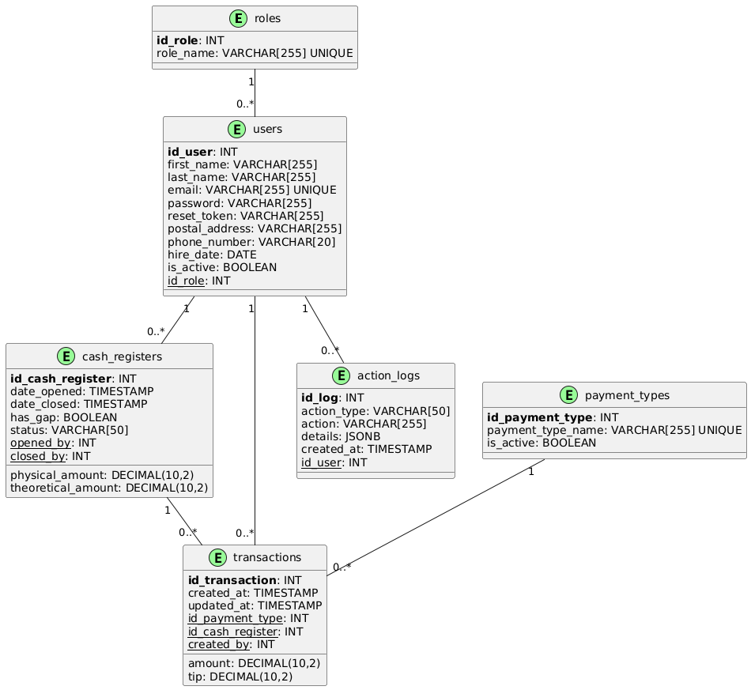
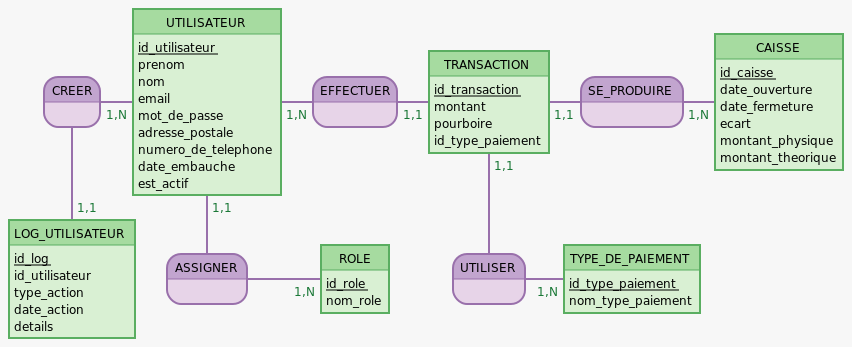
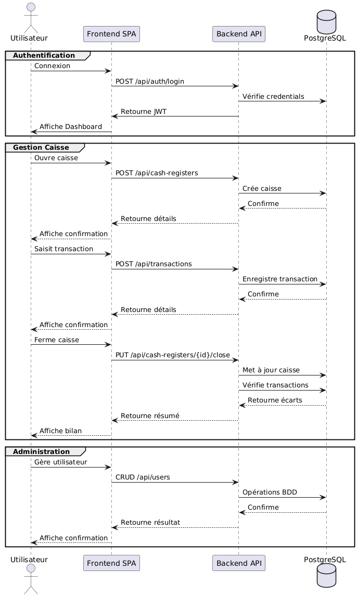
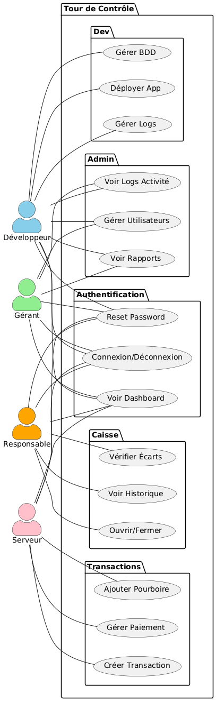

# Document de conception - Application Web "Tour de Contrôle"

## Diagramme ERD (Entité-Relation-Diagram)



```
@startuml
' Definition of entities

!define table(x) class x << (E,#98FB98) >>
!define primary_key(x) <b>x</b>
!define foreign_key(x) <u>x</u>

table(roles) {
   primary_key(id_role): INT
   role_name: VARCHAR[255] UNIQUE
}

table(users) {
   primary_key(id_user): INT
   first_name: VARCHAR[255]
   last_name: VARCHAR[255]
   email: VARCHAR[255] UNIQUE
   password: VARCHAR[255]
   reset_token: VARCHAR[255]
   postal_address: VARCHAR[255]
   phone_number: VARCHAR[20]
   hire_date: DATE
   is_active: BOOLEAN
   foreign_key(id_role): INT
}

table(payment_types) {
   primary_key(id_payment_type): INT
   payment_type_name: VARCHAR[255] UNIQUE
   is_active: BOOLEAN
}

table(cash_registers) {
   primary_key(id_cash_register): INT
   date_opened: TIMESTAMP
   date_closed: TIMESTAMP
   has_gap: BOOLEAN
   physical_amount: DECIMAL(10,2)
   theoretical_amount: DECIMAL(10,2)
   status: VARCHAR[50]
   foreign_key(opened_by): INT
   foreign_key(closed_by): INT
}

table(transactions) {
   primary_key(id_transaction): INT
   amount: DECIMAL(10,2)
   tip: DECIMAL(10,2)
   created_at: TIMESTAMP
   updated_at: TIMESTAMP
   foreign_key(id_payment_type): INT
   foreign_key(id_cash_register): INT
   foreign_key(created_by): INT
}

table(action_logs) {
   primary_key(id_log): INT
   action_type: VARCHAR[50]
   action: VARCHAR[255]
   details: JSONB
   created_at: TIMESTAMP
   foreign_key(id_user): INT
}

roles "1" -- "0..*" users
users "1" -- "0..*" transactions
users "1" -- "0..*" cash_registers
users "1" -- "0..*" action_logs
payment_types "1" -- "0..*" transactions
cash_registers "1" -- "0..*" transactions
@enduml

```

## MCD (Modèle Conceptuel de données)



```
%%mocodo
:::
UTILISATEUR: id_utilisateur, prenom, nom, email, mot_de_passe, adresse_postale, numero_de_telephone, date_embauche, est_actif, #id_role > ROLE > id_role
:::
TRANSACTION: id_transaction, montant, pourboire, id_type_paiement 1, #id_utilisateur > UTILISATEUR > id_utilisateur, #id_caisse > CAISSE > id_caisse, #id_type_paiement 2 > TYPE_DE_PAIEMENT > id_type_paiement
:::
CAISSE: id_caisse, date_ouverture, date_fermeture, ecart, montant_physique, montant_theorique
:


:
LOG_UTILISATEUR: id_log, id_utilisateur 1, type_action, date_action, details, #id_utilisateur 2 > UTILISATEUR > id_utilisateur
:::
ROLE: id_role, nom_role
:::
TYPE_DE_PAIEMENT: id_type_paiement, nom_type_paiement
:::

```

## Diagramme de séquence



```
@startuml

' Acteurs
actor "Utilisateur" as USER
participant "Frontend SPA" as FRONT
participant "Backend API" as API
database "PostgreSQL" as DB

' Authentication
group Authentification
   USER -> FRONT: Connexion
   FRONT -> API: POST /api/auth/login
   API -> DB: Vérifie credentials
   API -> FRONT: Retourne JWT
   FRONT -> USER: Affiche Dashboard
end

' Cash Register
group Gestion Caisse
   USER -> FRONT: Ouvre caisse
   FRONT -> API: POST /api/cash-registers
   API -> DB: Crée caisse
   DB --> API: Confirme
   API --> FRONT: Retourne détails
   FRONT --> USER: Affiche confirmation

   USER -> FRONT: Saisit transaction
   FRONT -> API: POST /api/transactions
   API -> DB: Enregistre transaction
   DB --> API: Confirme
   API --> FRONT: Retourne détails
   FRONT --> USER: Affiche confirmation

   USER -> FRONT: Ferme caisse
   FRONT -> API: PUT /api/cash-registers/{id}/close
   API -> DB: Met à jour caisse
   API -> DB: Vérifie transactions 
   DB --> API: Retourne écarts
   API --> FRONT: Retourne résumé
   FRONT --> USER: Affiche bilan
end

' Admin
group Administration
   USER -> FRONT: Gère utilisateur
   FRONT -> API: CRUD /api/users
   API -> DB: Opérations BDD
   DB --> API: Confirme
   API --> FRONT: Retourne résultat
   FRONT --> USER: Affiche confirmation
end

@enduml

```

## Use Cases



```
@startuml
left to right direction
skinparam actorStyle awesome

' Acteurs
actor "Développeur" as D #SkyBlue
actor "Gérant" as G #LightGreen
actor "Responsable" as R #Orange
actor "Serveur" as S #Pink

package "Tour de Contrôle" {
 ' Use cases communs
 package "Authentification" {
   usecase "Connexion/Déconnexion" as UC1
   usecase "Reset Password" as UC2
   usecase "Voir Dashboard" as UC3
 }

 ' Use cases développeur & gérant
 package "Admin" {
   usecase "Gérer Utilisateurs" as UC7
   usecase "Voir Logs Activité" as UC8
   usecase "Voir Rapports" as UC9
 }

 ' Use cases développeur
 package "Dev" {
   usecase "Gérer Logs" as UC4
   usecase "Déployer App" as UC5
   usecase "Gérer BDD" as UC6
 }

 ' Use cases responsable
 package "Caisse" {
   usecase "Ouvrir/Fermer" as UC10
   usecase "Voir Historique" as UC11
   usecase "Vérifier Écarts" as UC12
 }

 ' Use cases serveur
 package "Transactions" {
   usecase "Créer Transaction" as UC13
   usecase "Gérer Paiement" as UC14
   usecase "Ajouter Pourboire" as UC15
 }
}

' Relations communes
D -- UC1
D -- UC2
D -- UC3
G -- UC1
G -- UC2
G -- UC3
R -- UC1
R -- UC2
R -- UC3
S -- UC1
S -- UC2
S -- UC3

' Relations Admin (Dev & Gérant uniquement)
D -- UC7
D -- UC8
D -- UC9
G -- UC7
G -- UC8
G -- UC9

' Relations Dev uniquement
D -- UC4
D -- UC5
D -- UC6

' Relations Responsable
R -- UC10
R -- UC11
R -- UC12

' Relations Serveur
S -- UC13
S -- UC14
S -- UC15
@enduml

```

## Dictionnaire de donnée

### Tables Principales

#### ROLES

| Field | Type | Size | Description | Constraints |
|-------|------|------|-------------|-------------|
| id_role | INT | - | Identifiant unique du rôle | PK, Auto-increment |
| role_name | VARCHAR | 255 | Nom du rôle | NOT NULL, UNIQUE |

#### USERS

| Field | Type | Size | Description | Constraints |
|-------|------|------|-------------|-------------|
| id_user | INT | - | Identifiant unique | PK, Auto-increment |
| first_name | VARCHAR | 255 | Prénom | NOT NULL |
| last_name | VARCHAR | 255 | Nom | NOT NULL |
| email | VARCHAR | 255 | Email professionnel | NOT NULL, UNIQUE |
| password | VARCHAR | 255 | Mot de passe hashé | NOT NULL |
| reset_token | VARCHAR | 255 | Token réinitialisation | - |
| postal_address | VARCHAR | 255 | Adresse postale | - |
| phone_number | VARCHAR | 20 | Numéro de téléphone | - |
| hire_date | DATE | - | Date d'embauche | NOT NULL |
| is_active | BOOLEAN | - | Statut du compte | NOT NULL, Default true |
| id_role | INT | - | Rôle de l'utilisateur | FK -> ROLES |

#### PAYMENT_TYPES

| Field | Type | Size | Description | Constraints |
|-------|------|------|-------------|-------------|
| id_payment_type | INT | - | Identifiant unique | PK, Auto-increment |
| payment_type_name | VARCHAR | 255 | Nom du type de paiement | NOT NULL, UNIQUE |
| is_active | BOOLEAN | - | Statut d'activation | NOT NULL, Default true |

#### CASH_REGISTERS

| Field | Type | Size | Description | Constraints |
|-------|------|------|-------------|-------------|
| id_cash_register | INT | - | Identifiant unique | PK, Auto-increment |
| date_opened | TIMESTAMP | - | Date d'ouverture | NOT NULL, Default NOW() |
| date_closed | TIMESTAMP | - | Date de fermeture | - |
| has_gap | BOOLEAN | - | Présence d'écart | Default false |
| physical_amount | DECIMAL | (10,2) | Montant physique | NOT NULL |
| theoretical_amount | DECIMAL | (10,2) | Montant théorique | NOT NULL |
| status | VARCHAR | 50 | État (OPEN/CLOSED) | CHECK IN ('OPEN','CLOSED') |
| opened_by | INT | - | Utilisateur ouvreur | FK -> USERS |
| closed_by | INT | - | Utilisateur fermeur | FK -> USERS |

#### TRANSACTIONS

| Field | Type | Size | Description | Constraints |
|-------|------|------|-------------|-------------|
| id_transaction | INT | - | Identifiant unique | PK, Auto-increment |
| amount | DECIMAL | (10,2) | Montant | NOT NULL, CHECK > 0 |
| tip | DECIMAL | (10,2) | Pourboire | Default 0, CHECK >= 0 |
| created_at | TIMESTAMP | - | Date de création | NOT NULL, Default NOW() |
| updated_at | TIMESTAMP | - | Date de mise à jour | NOT NULL, Default NOW() |
| id_payment_type | INT | - | Type de paiement | FK -> PAYMENT_TYPES |
| id_cash_register | INT | - | Caisse associée | FK -> CASH_REGISTERS |
| created_by | INT | - | Utilisateur créateur | FK -> USERS |

#### ACTION_LOGS

| Field | Type | Size | Description | Constraints |
|-------|------|------|-------------|-------------|
| id_log | INT | - | Identifiant unique | PK, Auto-increment |
| action_type | VARCHAR | 50 | Type d'action | CHECK IN ('AUTH','CASH','TRANSACTION','USER','SYSTEM') |
| action | VARCHAR | 255 | Description action | NOT NULL |
| details | JSONB | - | Détails additionnels | - |
| created_at | TIMESTAMP | - | Date de création | NOT NULL, Default NOW() |
| id_user | INT | - | Utilisateur associé | FK -> USERS |

##### Notes

- Tous les champs TIMESTAMP incluent le fuseau horaire
- Les clés étrangères ont ON DELETE RESTRICT par défaut
- Des index sont créés sur les colonnes de jointure fréquentes